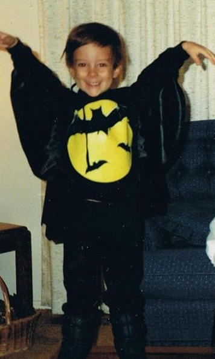

# Mr. Mueller  
---
## _Software Engineering Teacher_
#### **High School of Telecommunication Arts and Technology**  
#### bmueller@hstat.org

Mr. Mueller grew up in Colorado and moved to Brooklyn, NY in 2011.  He began his career as a math teacher, but switched to teaching computer science as a part of the NYC Software Engineering Pilot.

Schedule  
1. Prep  
2. SEP11  
3. SEP11  
4. Prep  
5. SEP10  
6. SEP10  
7. APCSA  
8. Prep

Thanks for viewing!

